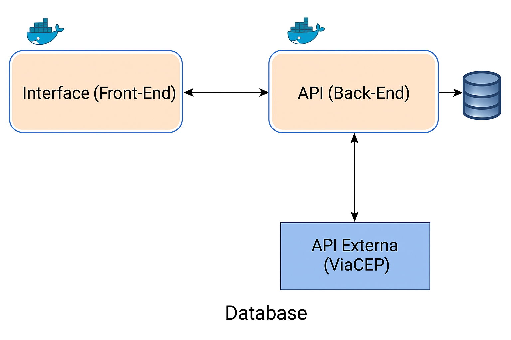

# 📘 Consulta CEP - Frontend

Interface web moderna e intuitiva para consulta de CEPs via API integrada ao [ViaCEP](https://viacep.com.br/).  
Esta aplicação permite o usuário logado consultar endereços, visualizar histórico, e gerenciar créditos de forma segura e responsiva.

## 🚀 Tecnologias Utilizadas

- [React.js](https://reactjs.org/)
- [Vite](https://vitejs.dev/)
- [React Router](https://reactrouter.com/)
- [Fetch API](https://developer.mozilla.org/pt-BR/docs/Web/API/Fetch_API)
- [Docker](https://www.docker.com/)

---

## 📷 Interface

> A aplicação se comunica com um backend protegido por token, que por sua vez acessa a API do ViaCEP e persiste os dados em um banco SQLite.  



---

## ⚙️ Como executar localmente

### Pré-requisitos

- Node.js instalado (versão 16+ recomendada)
- Docker (caso queira rodar via container)
- Backend rodando em `http://127.0.0.1:8000` (como [este projeto backend](https://github.com/seu-usuario/consulta-cep-backend))

### Instalação e execução local

```bash
# 1. Clone o repositório
git clone https://github.com/seu-usuario/consulta-cep-frontend.git

# 2. Acesse a pasta
cd consulta-cep-frontend

# 3. Instale as dependências
npm install

# 4. Rode a aplicação
npm run dev
```

A aplicação estará disponível em: [http://localhost:5173](http://localhost:5173)

---

## 🐳 Rodando com Docker

### Criando imagem Docker

```bash
docker build -t consulta-cep-frontend .
```

### Rodando container

```bash
docker run -d -p 8080:80 --name cep-frontend consulta-cep-frontend
```

Acesse a aplicação via: [http://localhost:8080](http://localhost:8080)

---

## 🔐 Funcionalidades

- 🔐 Autenticação de usuário via token JWT
- 📫 Consulta de endereço por CEP
- 🧾 Histórico de consultas com valores de crédito
- 💳 Visualização, adição e remoção de créditos
- 📘 Documentação da API integrada com resposta dinâmica

---

## 🔗 Licença e créditos

- Este projeto utiliza dados públicos da [API ViaCEP](https://viacep.com.br/)
- O uso da API ViaCEP é gratuito e sujeito aos [termos de uso](https://viacep.com.br/)

---

## ✨ Desenvolvido por

Patrick Soares de Oliveira  
Analista de Sistemas | Desenvolvedor Fullstack
